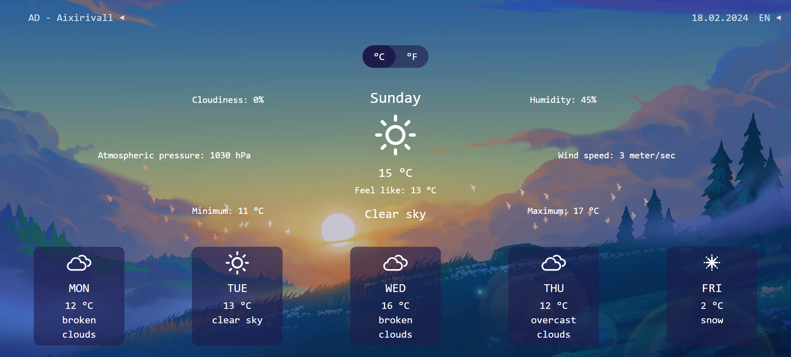

# Weather Forecast App

## Overview

This is a weather forecasting web application built with React, TypeScript, and Vite. It provides users with a comprehensive weather forecast for the current day and the next five days, along with essential additional features such as cloud cover, atmospheric pressure, minimum and maximum temperature, wind speed, and humidity. The application supports internationalization in English, Ukrainian, Russian, French, and Spanish, allowing users to access the interface in their preferred language.

## DEMO Version

Check out the DEMO version of the web application on Netlify: [WApp Netlify DEMO](https://weather-forecast-app-by-lobix.netlify.app/).

## Features

- Weather forecast for the current day and the next five days.
- Main additional features including cloud cover, atmospheric pressure, temperature, wind speed, and humidity.
- Support for changing units of measurement from metric (celsius) to imperial (fahrenheit).
- Internationalization in English, Ukrainian, Russian, French, and Spanish.
- Ability to change the location and view the current weather and forecast for the next five days for the selected location.
- Responsive design for optimal viewing across devices.

## Technology Stack

- **React**: Frontend JavaScript library for building user interfaces.
- **TypeScript**: Typed superset of JavaScript for improved code quality and maintainability.
- **Vite**: Next-generation frontend build tool for fast and efficient development.
- **Tailwind CSS**: Utility-first CSS framework for styling the application.
- **Redux Toolkit**: State management library for predictable state containers in JavaScript applications.
- **Axios**: Promise-based HTTP client for making requests to external APIs.
- **FontAwesome**: Icon library for adding scalable vector icons to the application.
- **React Select**: Customizable select input control for React applications.
- **React-i18next**: Internationalization framework for React applications.

## Installation

To run the application locally, follow these steps:

1. Clone this repository to your local machine.
2. Navigate to the project directory.
3. Install dependencies using `npm install`.
4. Start the development server with `npm run dev`.
5. Access the application at `http://localhost:5173/` in your web browser.

## Usage

- Upon launching the application, users are presented with the current weather forecast for their current location.
- Users can change the location by entering a city name or selecting a location from the dropdown menu.
- The application provides detailed weather information for the current day and the next five days.
- Users can switch between metric (celsius) and imperial (fahrenheit) units for temperature measurements.
- The interface language can be changed using the language selector dropdown.

## Contributing

Contributions to this project are welcome! Feel free to submit bug reports, feature requests, or pull requests to help improve the application.
